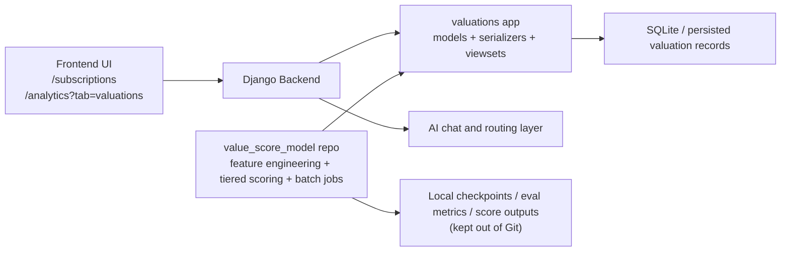

# README_AI

AI feature documentation for the local Django integration milestone.

## AI Workflow Explanation

The current AI workflow is organized as a Django-backed valuation system with a supporting standalone scoring package.

1. User data enters the application through subscriptions, transactions, onboarding preferences, and other computed or inferred user signals.
2. Django persists valuation-ready entities through the `subscriptions`, `transactions`, `users`, and `valuations` apps.
3. Valuation records are stored in `SubscriptionValuation` and `ItemValuation`, including:
   - `personal_value_score`
   - `recommendation`
   - `confidence`
   - `evidence_json`
   - explanation or reasoning payloads
4. Authenticated API endpoints expose those records:
   - `/api/subscription-valuations/`
   - `/api/item-valuations/`
   - `/api/valuation-model-versions/`
5. The frontend consumes those endpoints and renders value-score UI in the subscriptions and analytics flows.
6. The sibling [`value_score_model`](https://github.com/zapp-startup/value_score_model) repository provides the reusable ML/scoring package for feature engineering, training, batch scoring, and evidence generation.

## Model Selection Rationale

The supporting value-score model uses a tiered approach because user data density varies a lot in a consumer finance product.

- Tier 1: cold-start model
  handles users or subscriptions with very little transaction history so the system still returns a recommendation instead of failing
- Tier 2: XGBoost model
  serves as the main structured-data learner for medium-history users, where tabular behavioral features are informative and efficient
- Tier 3: neural model
  is reserved for high-data cases where richer user and merchant interactions can justify a more expressive model

Why this design fits the project:

- It is resilient to sparse real-world onboarding states.
- It gives a practical path from heuristic cold-start behavior to learned scoring.
- It keeps the backend integration simple because the Django layer only needs stable valuation outputs and evidence payloads.
- It avoids requiring large pretrained weights to be committed into the repo.

## Architecture Diagram



## Evaluation Summary

The AI feature is supported by two layers of validation.

### 1. Django integration validation

The backend currently demonstrates:

- persisted valuation data models with confidence and evidence fields
- authenticated viewsets for subscription and item valuations
- frontend-facing valuation consumption paths already used by the app
- model version tracking for auditability

### 2. Supporting model-package validation

The sibling `value_score_model` package already includes:

- synthetic dataset generation
- feature-engineering tests
- tier-specific tests for cold start, XGBoost, and neural scoring
- end-to-end fit/predict tests
- overutilisation bonus validation
- evaluation metrics utilities covering MAE, RMSE, Spearman ranking, calibration, and NDCG

Fresh numeric benchmark results were not regenerated in this implementation session because the required ML dependencies are not installed in the current sandbox. The documented evaluation approach is therefore based on the code and existing test coverage already present in the repo.

## Failure Analysis

The current system is functional for milestone documentation, but there are still important limitations to call out honestly.

### 1. Runtime linkage is indirect today

The backend clearly stores and serves valuations, and the supporting model package clearly implements the scoring logic, but the current repo state does not show a direct Django runtime import from `backend` into `value_score_model`. That means the integration write-up should describe the model repo as the supporting scoring engine, not claim a fully embedded inference service unless that code is added.

### 2. Dependency separation can block quick local reproduction

The current environment used for this documentation session does not have the ML dependencies installed, so the training and model tests could not be rerun here. A clean machine will need the package-specific dependencies installed before generating fresh checkpoints or metrics.

### 3. Sparse-data scenarios remain challenging

For users with little transaction history, the system depends on the cold-start path and user preference features. This is the correct fallback, but confidence is naturally lower when there is limited behavioral evidence.

### 4. Valuations app test coverage is lighter than model-package coverage

The backend `valuations` app exposes working serializers, models, and viewsets, but it does not yet have the same depth of automated tests as the standalone model package.

## Improvement Made

This milestone improves the project in several concrete ways.

- Added a formal valuation domain in Django with version tracking and evidence storage.
- Added authenticated subscription and item valuation APIs for frontend consumption.
- Exposed valuation outputs in user-facing frontend flows that already show recommendation and value-score information.
- Kept model artifacts out of the repo and documented the local-only artifact workflow.
- Preserved explainability by storing `evidence_json` and explanation payloads alongside each valuation.

## How To Run The AI-Related Flow Locally

### Backend

```powershell
python -m venv .venv
.\.venv\Scripts\Activate.ps1
pip install -r requirements.txt
Copy-Item .env.example .env
python manage.py migrate --settings=zapp.settings.development
python manage.py runserver --settings=zapp.settings.development
```

### Frontend

```powershell
cd ..\frontend
npm install
npm run dev
```

### Supporting model package

```powershell
cd ..
python -m venv .venv
.\.venv\Scripts\Activate.ps1
pip install -r value_score_model/requirements.txt
python -m value_score_model.train --synthetic --n-users 50 --n-merchants 20
```

## Model Download Notes

- No model weights are committed to the repo.
- Large binaries such as `.pt`, `.bin`, `.safetensors`, cached artifacts, and checkpoints are ignored by Git.
- If model artifacts are needed for local experimentation, they should be generated or downloaded locally and kept outside version control.